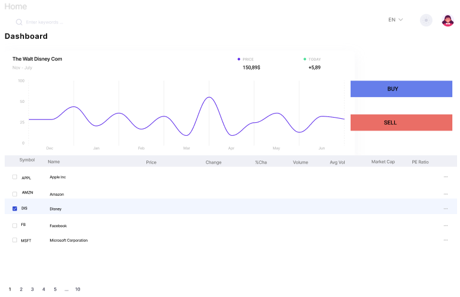

# React Stock Market Dashboard Project.
 

## Table of contents
   - [1. Description](#1-description)
   - [2. Initial Design](#2-design)
   - [3. Prototype](#3-prototype)
   - [4. Project information](#4-project-information)
   - [5. Setup](#5-setup)
   - [6. Project View](#6-project-view)

 

### **1. Description**
  

Crypto Project - deployed to <a href="https://sashot.gitlab.io/stock-market-dashboard" target="_blank">Gitlab page</a>

 

### **2. Initial Design**
 

 Inial design is created with figma - [Figma Design](https://www.figma.com/file/sHykSXnAmYuFATmZnSSmN7/StockMarket?node-id=1%3A6)

 

### **3. Prototype**
 

 Prototype is created with figma  - [Figma Prototype](https://www.figma.com/proto/sHykSXnAmYuFATmZnSSmN7/StockMarket?node-id=6%3A22&scaling=scale-down&page-id=1%3A6&starting-point-node-id=6%3A22)

 

### **4. Issue Board**

 

- [Board](https://gitlab.com/SashoT/stock-market-dashboard/-/boards)

 

### **5. Project information**

 

- Language and version: **JavaScript ES2020**
- Platform and version: **Node 1.0+**
- Core Packages:  **ESLint**,  **React**,  **Webpack** ,  **Babel**

 

### **6. Structure**
- Project structure consists of two main parts - back-end (folder server) and front-end (folder client)
  -  For the use of the project server is used json server.

 

 

### **7. Setup**
   - 1. Clone/download repo
   - 2. yarn install (or npm install for npm) a-for client(src folder) and server

 

### **8. Usage**
   - `npm run start` - starts the project -App served @ http://localhost:3000

All commands:

- `npm run start` - starts the project
- `npm run lint` - run lint
- `npm run lint:fix` - fix lint errors
- `npm run format` - Format code
- `npm run build `-create bundle
- `npm run auth` -run server